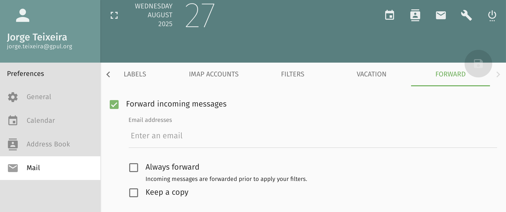
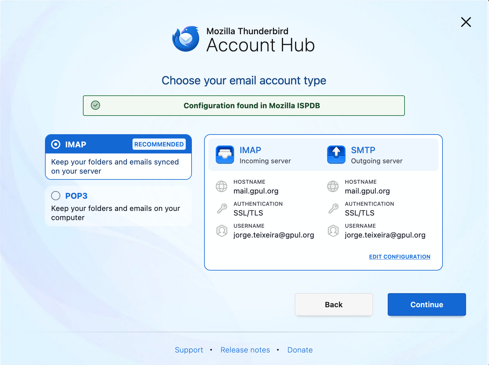
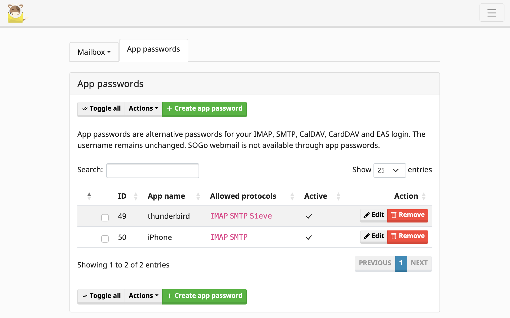

# Guía de usuario

Guía para configurar e utilizar o correo electrónico de GPUL.

## Prerrequisitos

Para utilizar o correo electrónico de GPUL necesitas:

- Ter unha conta de usuario en Keycloak (<a href="https://identity.gpul.org" target="_blank">identity.gpul.org</a>) co atributo personalizado "GPUL Email" configurado co enderezo correcto
- Ten en conta que o correo principal de Keycloak debe ser o teu correo persoal e non o @gpul.org, xa que doutra forma non poderías verificar o correo nin cambiar a contrasinal se perdes o acceso
- Se non tes unha conta, consulta a [documentación de Keycloak](../keycloak/user-guide) para ver como obter unha

## Uso do webmail

Para acceder ao teu correo a través do navegador:

1. Vai a <a href="https://mail.gpul.org" target="_blank">mail.gpul.org</a>
2. Na páxina de inicio de sesión de Mailcow, selecciona a opción **SSO** (Single Sign-On)
3. Inicia sesión coa túa [identidade de Keycloak](../keycloak/user-guide)
4. Terás acceso á caixa de correo configurada como "GPUL Email" no teu atributo de usuario de Keycloak
5. Se hai un erro ao iniciar sesión, probablemente o campo "GPUL Email" estea baleiro

## Xestión de redirección

:::info

Como a nosa configuración anterior só incluía redirección de correo, así está configurado por defecto. Os usuarios poden querer manter a redirección pero **non deberían enviar mensaxes dende outros servidores de correo** (xa que agora os campos SPF só permiten enviar desde servidores de correo autorizados).

:::

Para isto deberán usar un cliente de correo correctamente configurado ou o webmail. Para cambiar a redirección:

1. Na interface do webmail, fai clic na icona de engranaxe (⚙️) xunto ao nome do perfil na caixa de correo
2. Selecciona "Mail" na barra lateral esquerda
3. Vai á pestana "Forward"
4. Desactivar "Forward incoming messages"

## Configuración de clientes

Para a maioría dos clientes de correo, por exemplo Thunderbird, a configuración será recollida automaticamente polo cliente ao especificar o enderezo de correo correcto. Ten en conta que **POP3 está deshabilitado**, polo que só podes usar IMAP.

Para iniciar sesión, necesitarán crear unha contrasinal de aplicación para o cliente e é o que usarán desde o cliente. Para acceder á configuración de Mailcow, fai clic na chave inglesa (🔧) na parte superior dereita do webmail.

:::warning

Se recibes un erro de autenticación na interface de Thunderbird, proba a desactivar o novo "Account hub", en _Settings > General > Account hub_

:::

Para clientes de Apple, hai unha ligazón na interface de Mailcow que xera automaticamente unha contrasinal de aplicación e descarga o perfil que podes usar nos teus clientes iOS.

## Caixas de correo compartidas

Para información sobre como funcionan os alias organizacionais como presidencia@gpul.org ou info@gpul.org, consulta a [documentación de caixas de correo compartidas](./shared-mailboxes).
