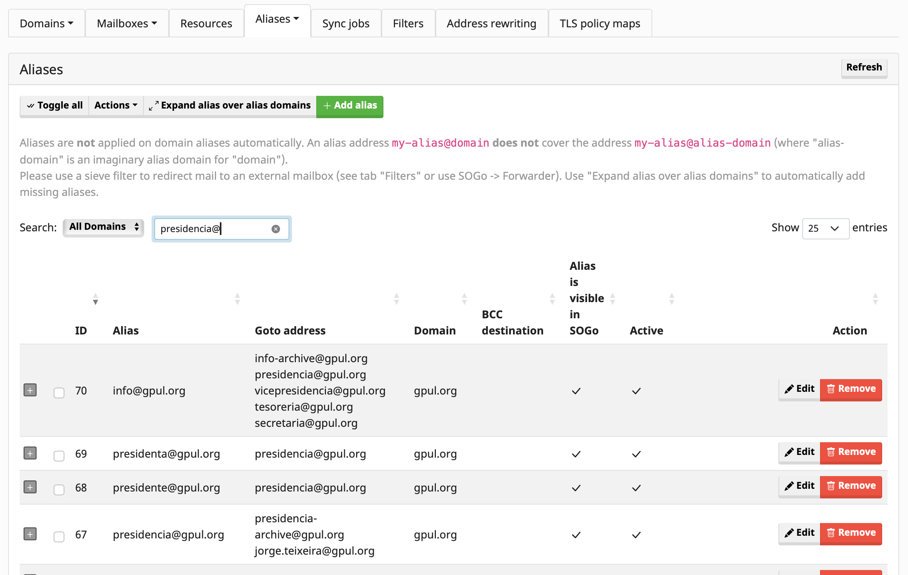
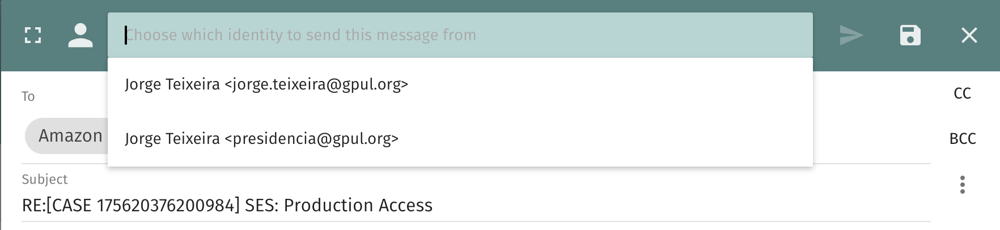

# Contas compartidas

Esta sección explica como funcionan as caixas de correo compartidas ou "personas" como presidencia@gpul.org, info@gpul.org, etc.

## Funcionamento dos alias compartidos

Os alias compartidos están pensados principalmente para **recibir** correo electrónico. 

### Exemplo: presidencia@gpul.org

Actualmente, o alias presidencia@gpul.org está configurado como:
- Un alias que reenvía a `presidencia-archive@gpul.org` (para arquivo)
- Un alias que reenvía ao enderezo persoal do presidente actual: `nome.apelido@gpul.org`

Desta forma, mantemos unha copia de todos os correos recibidos neste enderezo.

#### Nomes neutros de xénero

En lugar de usar presidente@ ou presidenta@, intentamos manter nomes neutros de xénero como presidencia@. Para evitar erros, tamén se configuran redireccións desde presidente@ e presidenta@ cara presidencia@.

## Protocolo para correos enviados

A posibilidade de enviar correo desde os alias que estamos configurados para recibir está configurada, aparecendo automaticamente no webmail. Pode requirir algúns axustes específicos dependendo do teu cliente de correo. **Non obstante, esta é unha posibilidade desaconsellada**.

Para correos **enviados**, esperase que respondas co teu enderezo de correo persoal mentres mantés en **CC** o alias correspondente (presidencia@ ou calquera outro alias), de forma que:

- Outros usuarios estean ao tanto da conversación
- As mensaxes tamén queden arquivadas
- Se manteña a trazabilidade das comunicacións

## Outros alias compartidos

Este mesmo funcionamento aplícase a outros alias como:
- info@gpul.org
- secretaria@gpul.org
- tesouraria@gpul.org
- E outros alias organizacionais

Cada un ten o seu correspondente enderezo de arquivo e reenvía ao responsable actual do rol.
